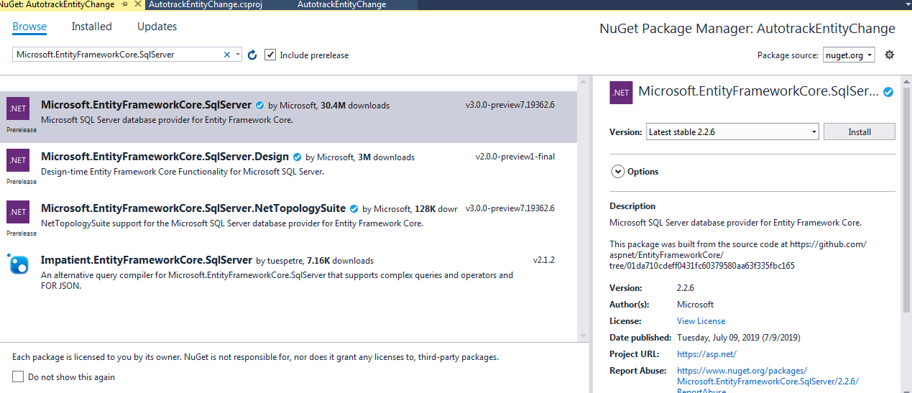
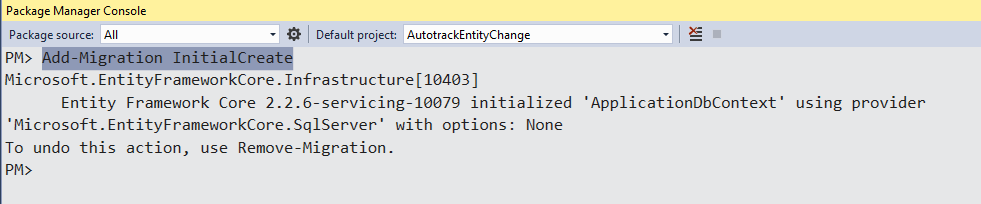
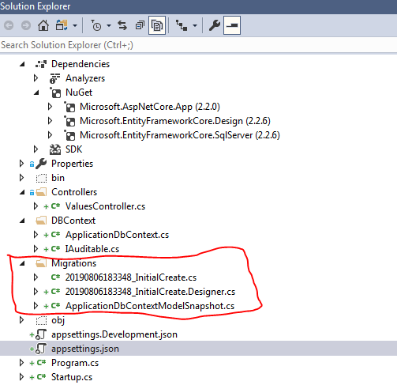
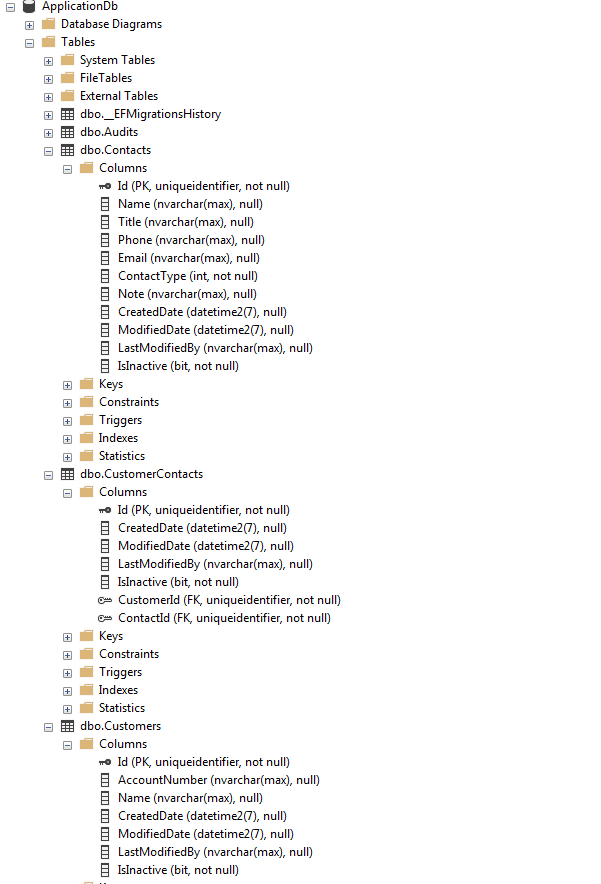

# Automatically create change log as Audit using EntityFramework in a .Net Core Project
  

## Introduction  
It is often needed to track the changes in the field in data-driven applications. Such tracking is needed for getting answers to the questions like following:  

- Who changed?
- What changed?
- How is the latest change compare with the old values? 
- When did the change take place? etc.  

These changes can be displayed in the view as part of history. The answer to these questions can be considered as audit log or change log. A conventional way of tracking the changes is to populate the change somewhere in the table. With the EntityFrame work, these changes can be tracked automatically with some code change. In addition, the auto-tracking of changes will work for any tables that will be added to the application in future provided that the new tables follow the same convention as in the original tables. 
 
In this article, I am going to present one simple design where such changes can be tracked and stored in the database using Entity Framework without having to manage the change tracking process. The benefit of this design is that it can track any or all of the tables and change tracking can be made at a centralized location, i.e. just before the actual update in the database. The changes themselves will be stored on a separate table which can be retrieved along with the main records for downstream processes.

In this article, I am going to show how to get started with EntityFramework. I am going to use a .Net Core Web API project in which EF support has already been added. If you need to know how to add the EF support to a project, please refer to my article [Adding EntityFrameworkCore Support to .NET Core Project](https://www.codeproject.com/Articles/5164086/Adding-EntityFrameworkCore-Support-to-NET-Core-Pro). I am using Visual Studio 2017, MS SQL Server with SQL Server Management Studio and EntityFrameworkCore with .Net Core SDK 2.2.  

The code related to this article is available at [GitHub](https://github.com/benktesh/AutotrackEntityChange). 

## Audit Log Design
In this example, I am going to use the following schema to store the Audit Log.

		public class Audit
	    {
	        public Guid Id { get; set; }	
	        public Guid? EntityId { get; set; }	
	        public string User { get; set; }	
	        public String Entity { get; set; }	
	        public DateTime DateTime { get; set; }	
	        public string ColumnName { get; set; }	
	        public String OldValue { get; set; }	
	        public String NewValue { get; set; }	
	        public EntityStateChangeTypeEnum ChangeType { get; set; }
	    }

In this table, I expect to store the name of the table in "Entity", RecordID in "EntityId", User who made the change, Date and Time of change, Field that was changed as "ColumnName", old and new values, and finally changetype. ChangeType is defined as enum where valid values are add, remove, update. 

For example, if a Customer data is added, the end result is that the Audit table contains rows for each of the fields in Customer. 

I first created an empty solution in Visual Studio and added a WebAPI project target .Net Core 2.2.  

I am using MS Sql Server so I am looking for 'Microsoft.EntityFrameworkCore.SqlServer' using Nuget Package for EntityFramework.    

Right click on the project and click 'Manage NuGet Package' and select the latest stable version which is currently at 2.2.6.  

  

I am going to use code-first migration and therefore, I am also adding reference to 'Microsoft.EntityFrameworkCore.Design'.  

I am going to update the appsetting.json file for connection string. I am using MS SQLServer that is locally available in my machine. I am naming my connection as 'DefaultConnection' and name of database as 'ApplicaitonDb'. I will update the appsetting.json file by adding the following:  

	 "ConnectionStrings": {
		"DefaultConnection": "Server=(localdb)\\mssqllocaldb;Database=ApplicationDb;Trusted_Connection=True;"
	  }

## Configure Database and Models
I am going to organize code related to Entity Framework in a separate folder. Therefore, I am adding a folder 'DBContenxt' within the project. Next, I am going to add the tables in my database using code-first method.  

I am going to add three tables namely Customer, Contact, CustomerContact. The code example shows additional two additional classes IAuditable, and Audit. The purpose of the Audit table is to store change history happening in all the tables and IAuditable is an interface to unify the Auditable property. These are there for additional work, can be ignored for now. There are a number of Enums which are used to provide type information for customer data. Customer and Contact entity have many to many relationships and thus I added CustomerContact entity to store the relationship. 

	using System;
	using System.Collections.Generic;
	using System.Linq;
	using System.Threading.Tasks;
	
	namespace AutotrackEntityChange.DBContext
	{
	    public class Customer : IAuditable
	    {
	        public Guid Id { get; set; }
	        public String AccountNumber { get; set; }
	        public String Name { get; set; }
	        public DateTime? CreatedDate { get; set; }
	        public DateTime? ModifiedDate { get; set; }
	        public String LastModifiedBy { get; set; }
	        public bool IsInactive { get; set; }
	        public ICollection<CustomerContact> CustomerContacts { get; set; }
	    }
	
	    public class Contact : IAuditable
	    {
	
	        public Guid Id { get; set; }	
	        public String Name { get; set; }	
	        public String Title { get; set; }	
	        public String Phone { get; set; }	
	        public String Email { get; set; }	
	        public ContactTypeEnum ContactType { get; set; }	
	        public String Note { get; set; }	
	        public DateTime? CreatedDate { get; set; }	
	        public DateTime? ModifiedDate { get; set; }	
	        public String LastModifiedBy { get; set; }	
	        public bool IsInactive { get; set; }
	        public ICollection<CustomerContact> CustomerContacts { get; set; }	
	    }
	
	    public class CustomerContact:IAuditable
	    {
	        public Guid Id { get; set; }
	        public DateTime? CreatedDate { get; set; }
	        public DateTime? ModifiedDate { get; set; }
	        public string LastModifiedBy { get; set; }
	        public bool IsInactive { get; set; }
	        public Guid CustomerId { get; set; }
	        public Customer Customer { get; set; }
	        public Guid ContactId { get; set; }
	        public Contact Contact { get; set; }
	    }
	
	    public class Audit
	    {
	        public Guid Id { get; set; }	
	        public Guid? EntityId { get; set; }	
	        public string User { get; set; }	
	        public String Entity { get; set; }	
	        public DateTime DateTime { get; set; }	
	        public string ColumnName { get; set; }	
	        public String OldValue { get; set; }	
	        public String NewValue { get; set; }	
	        public EntityStateChangeTypeEnum ChangeType { get; set; }
	
	    }
	    /// 

	    /// This interface determines what will be automatically tracked.
	    /// 

	    interface IAuditable
	    {
	        Guid Id { get; set; }
	
	        DateTime? CreatedDate { get; set; }
	
	        DateTime? ModifiedDate { get; set; }
	
	        String LastModifiedBy { get; set; }
	
	        bool IsInactive { get; set; }
	    }
	
	    public enum EntityStateChangeTypeEnum
	    {
	        Added,
	        Deleted,
	        Modified,
	    }
	
	    public enum ContactTypeEnum
	    {
	        Primary,
	        Secondary,
	        Emergency,
	    }
	}

With these, we are ready to move on to adding the model. I am creating create an class named 'ApplicationDbContext' that derives from 'DbContext' to configure the EntityFramework. In this class, I first define all the three tables as DbSet and add a public constructor to wire-up the DbContext to the database.

	using Microsoft.EntityFrameworkCore;

	namespace AutotrackEntityChange.DBContext
	{
	    public class ApplicationDbContext: DbContext
	    {
	        //Define DbSets
	        public DbSet<Customer> Customers { get; set; }
	        public DbSet<Contact> Contacts { get; set; }
	
	        public DbSet<CustomerContact> CustomerContacts { get; set; }
	        public DbSet<Audit> Audits { get; set; }
	
	        public ApplicationDbContext(DbContextOptions<ApplicationDbContext> options)
	            : base(options)
	        {
	
	        }
	    }
	}

Since I am using SQLServer, I am adding sqlserver option in ConfigureServices in startup class referring to the 'ApplicationDbContext' created above.

	services.AddDbContext<ApplicationDbContext>(options =>
    	options.UseSqlServer(Configuration.GetConnectionString("DefaultConnection")));

## Add Migration and Update Database
With these changes, above, I am ready to create a migration using entity framework. In the package manager console in visual studio, run the following command:
	Add-Migration InitialCreate

  

After the command runs, the migration has been created. This will be evident the Solution Explorer. The migration folder contains migration files and design files. The content of these can be viewed in the code repository. In short, the migrations are instructions for database, in this example, to create tables and the relationships.

Now the migrations have been added, I can update the database so that migration can be applied. To do this, run the following command in package manager console:
	
	Update-database
When the above command runs, it creates tables and any updates defined in the migrations to the configured database. At this time, I can look at my SSMS for those tables in the ApplicationDb database.

## Summary
In this article, I provided an step-wise approach to add EntityFramework Code-First approach to .Net Core project. Because, I do not necessarily work on adding EntityFramework to a project everyday, the steps are hard to remember and these steps are involve careful execution. I used example for a WebAPI project, but these steps are equally applicable for MVC, or library projects. Finally, I used MS SQL Server as database. But depending on the need, the steps can be used to connect with other databases with minor changes in configuration. I am hoping this will help someone and I welcome comments and suggestions. 

## References  

[Entity Framework Core](https://docs.microsoft.com/en-us/ef/core/)  
[Entity Framework Core to an Existing ASP.NET Core Project](https://elanderson.net/2018/04/add-entity-framework-core-to-an-existing-asp-net-core-project)  
[Connection Strings](https://docs.microsoft.com/en-us/ef/core/miscellaneous/connection-strings)
[GitHub Code](https://github.com/benktesh/AutotrackEntityChange.git)  

